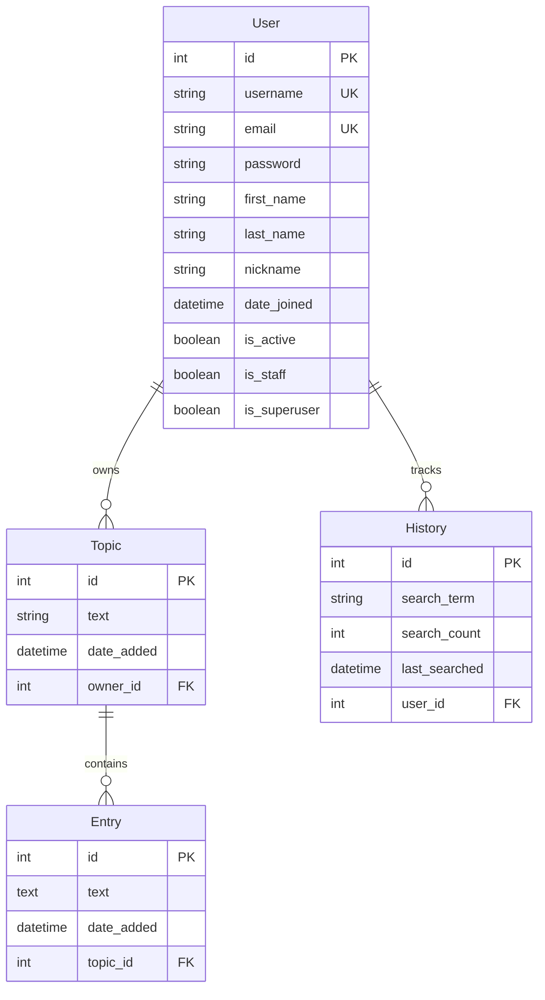

<h2 align="center">
  AyeNote - Cloud Notebook Platform <br/>
</h2>

<p align="center">
  
  
  
  
  
  
</p>

<p align="center">
  A Django-based cloud notebook platform for managing personal learning notes and book searches with data visualization features.
</p>

## Features

### Core Functionality
- **Topic & Note Management**: Create, edit, delete, and organize learning topics with detailed notes
- **Advanced Search**: Search notes by content and topic with filtering capabilities
- **User Authentication**: Registration, login, password reset, and profile management

### Book Search & Analytics
- **Douban Integration**: Search books with detailed information, ratings, and reviews
- **Search History**: Track and analyze user search behavior over time
- **Data Visualization**: Interactive charts showing search patterns and book rating distributions
- **Recommendations**: Book suggestions based on search history and preferences

### Technical Features
- **Responsive Design**: Bootstrap-based UI optimized for all devices
- **Admin Interface**: Enhanced Django admin panel with SimpleUI
- **Web Scraping**: Real-time book data collection using Selenium and BeautifulSoup

## Technology Stack

### Backend
- **Framework**: Django 4.2.1
- **Database**: MySQL
- **Authentication**: Django's built-in auth system with custom user model
- **Web Scraping**: Selenium WebDriver + BeautifulSoup
- **Data Visualization**: Pygal

### Frontend
- **UI Framework**: Bootstrap 3
- **Styling**: Custom CSS with responsive design
- **Charts**: SVG-based interactive visualizations
- **Templates**: Django template system

### Deployment
- **WSGI Server**: uWSGI
- **Static Files**: Django static files handling
- **Database**: MySQL with custom configurations

## Installation

### Prerequisites
- Python 3.8+
- MySQL 5.7+
- Chrome/Chromium browser (for web scraping)
- ChromeDriver

### Setup Instructions

1. **Clone the repository**
   ```bash
   git clone https://github.com/yourusername/AyeNote.git
   cd AyeNote
   ```

2. **Create virtual environment**
   ```bash
   python -m venv venv
   source venv/bin/activate  # On Windows: venv\Scripts\activate
   ```

3. **Install dependencies**
   ```bash
   pip install django==4.2.1
   pip install mysqlclient
   pip install selenium
   pip install beautifulsoup4
   pip install pygal
   pip install django-bootstrap3
   pip install django-bootstrap4
   pip install django-simpleui
   ```

4. **Database setup**
   - Create a MySQL database named `Learning_Log`
   - Update database credentials in `ayenote/settings.py`
   ```python
   DATABASES = {
       'default': {
           'ENGINE': 'django.db.backends.mysql',
           'NAME': 'Learning_Log',
           'USER': 'your_username',
           'PASSWORD': 'your_password',
           'HOST': '127.0.0.1',
           'PORT': '3306',
       }
   }
   ```

5. **Run migrations**
   ```bash
   python manage.py makemigrations
   python manage.py migrate
   ```

6. **Create superuser**
   ```bash
   python manage.py createsuperuser
   ```

7. **Install ChromeDriver**
   - Download ChromeDriver from https://chromedriver.chromium.org/
   - Add ChromeDriver to your system PATH

8. **Run the development server**
   ```bash
   python manage.py runserver
   ```

9. **Access the application**
   - Open your browser and navigate to `http://127.0.0.1:8000`

## Usage

### Getting Started
1. **Register an Account**: Create a new user account or use the admin panel
2. **Create Topics**: Start by creating topics for your learning areas
3. **Add Notes**: Add detailed notes under each topic with rich text content
4. **Search Books**: Use the book search feature to find and analyze books
5. **View Analytics**: Check your behavior analysis to see reading patterns

### Key Features
- **Note Management**: Organize learning materials, search through content, edit or delete as needed
- **Book Search**: Access Douban book database, view ratings and reviews, track search history
- **Data Analytics**: Visualize search patterns, view rating distributions, get personalized recommendations

## Project Structure

```
AyeNote/
├── ayenote/               # Main Django project
│   ├── settings.py        # Project settings
│   ├── urls.py           # Main URL configuration
│   └── wsgi.py           # WSGI configuration
├── notes/                 # Core application
│   ├── models.py         # Data models (Topic, Entry, History)
│   ├── views.py          # View functions
│   ├── forms.py          # Django forms
│   ├── urls.py           # App URL patterns
│   └── templates/        # HTML templates
├── users/                 # User authentication app
│   ├── models.py         # Custom user model
│   ├── views.py          # Auth views
│   └── templates/        # Auth templates
├── static/               # Static files (CSS, images)
├── templates/            # Global templates
├── manage.py            # Django management script
├── uwsgi.ini           # uWSGI configuration
└── README.md           # Project documentation
```

## Configuration

### Environment Settings
- **DEBUG**: Set to `False` in production
- **ALLOWED_HOSTS**: Configure for your domain
- **SECRET_KEY**: Use a secure secret key in production
- **Database**: Configure MySQL connection settings

### Email Configuration
The project supports email functionality for password reset:
```python
EMAIL_BACKEND = 'django.core.mail.backends.console.EmailBackend'  # Development
# Configure SMTP settings for production
```

### Static Files
Static files are configured to be served from multiple directories:
- Global static files: `/static/`
- App-specific static files: `/learning_logs/static/`

## API Integration

### Douban Book Search
The application integrates with Douban's book search API to provide:
- Book information and metadata
- User ratings and reviews
- Related book recommendations
- Price information from various retailers

### Web Scraping
Uses Selenium WebDriver for dynamic content scraping:
- Book reviews and ratings
- User comments and interactions
- Real-time book availability and pricing

## Database Schema

### Entity Relationship Diagram



### Data Model Details

| Model | Description | Key Fields |
|-------|-------------|------------|
| **User** | Extended Django user model | `username`, `email`, `nickname`, `is_active` |
| **Topic** | Learning material categories | `text`, `date_added`, `owner` |
| **Entry** | Individual notes and content | `text`, `date_added`, `topic` |
| **History** | Search behavior tracking | `search_term`, `search_count`, `user` |

### Database Features

- **User Isolation**: Each user can only access their own topics, entries, and search history
- **Hierarchical Organization**: Topics organize entries in a structured manner
- **Search Analytics**: History model tracks user behavior for data visualization
- **Referential Integrity**: Foreign key relationships ensure data consistency

## Contributing

1. Fork the repository
2. Create a feature branch (`git checkout -b feature/new-feature`)
3. Commit your changes (`git commit -am 'Add new feature'`)
4. Push to the branch (`git push origin feature/new-feature`)
5. Create a Pull Request

### Development Guidelines
- Follow Django best practices
- Write comprehensive tests
- Update documentation for new features
- Ensure code is compatible with Python 3.8+
- Follow PEP 8 style guidelines

## Security Considerations

- **CSRF Protection**: Enabled by default
- **User Authentication**: Secure login/logout functionality
- **Data Isolation**: Users can only access their own data
- **SQL Injection Protection**: Django ORM provides protection
- **XSS Protection**: Template auto-escaping enabled

## Performance Optimization

- **Database Indexing**: Optimized queries with proper indexes
- **Static File Serving**: Efficient static file handling
- **Caching**: Implement caching for frequently accessed data
- **Image Optimization**: Compressed images for faster loading

## License

This project is licensed under the Mozilla Public License 2.0 - see the [LICENSE](LICENSE) file for details.

## Support

For support and questions:
- Create an issue on GitHub
- Check the documentation
- Review existing issues and discussions

## Acknowledgments

- Django framework for the robust web development platform
- Bootstrap for responsive UI components
- Pygal for data visualization capabilities
- Douban for book information API
- All contributors who have helped improve this project

---

**Note**: Please ensure compliance with website terms of service when using web scraping features.